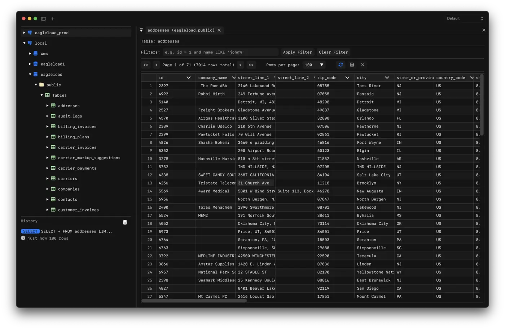

<p align="center">
  
</p>

<h1 align="center">SQLEditor</h1>

<p align="center">A simple, cross-platform database client.</p>




## Features

- Support SQLite, PostgreSQL, MySQL, MariaDB, MongoDB, and Redis connections
- Cross-platform: macOS (Metal), Linux (GTK4 + OpenGL)
- Database browser: Sidebar for exploring schemas, tables, and structure
- Native file dialogs for SQLite files
- Native alert/confirm dialogs per platform
- Saves and restores previous database connections
- Run SQL queries with formatted results display
- Query history

## Installation

Download the latest release for macOS, Linux, and Windows 

### Arch Linux 

```sh
yay -S sqleditor
# or
paru -S sqleditor
```

## Build instructions

```sh
claude "build this project"
```

## Built With

- [Dear ImGui](https://github.com/ocornut/imgui) - Immediate mode GUI
- [Native File Dialog](https://github.com/btzy/nativefiledialog-extended) - File pickers
- [IconFontCppHeaders](https://github.com/juliettef/IconFontCppHeaders) - Icon fonts
- [vcpkg.json](vcpkg.json) - Full dependency list
